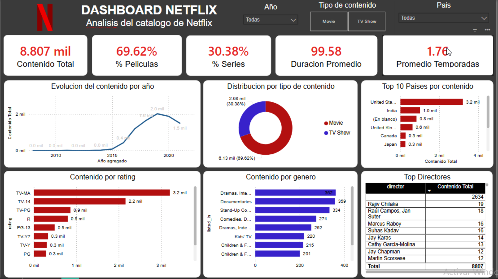

# Netflix Titles Analysis (SQL + Power BI)

## Descripción

Proyecto de análisis de datos del catálogo de Netflix utilizando SQL y Power BI. Se trabajó todo el flujo de un Data Analyst: desde la limpieza de datos hasta la creación de un dashboard interactivo para identificar tendencias clave en el contenido.

---

## Objetivo

Analizar el catálogo de Netflix para responder preguntas como:

* ¿Qué tipo de contenido predomina?
* ¿Qué países producen más contenido?
* ¿Cómo ha crecido el catálogo con el tiempo?
* ¿Qué géneros son más comunes?

---

## Herramientas utilizadas

* MySQL (SQL)
* Power BI
* Dataset en CSV (Netflix Titles)

---

## Proceso del proyecto

### 1. Extracción de datos

* Importación del dataset en MySQL
* Creación de base de datos y tabla estructurada

---

### 2. Limpieza y transformación (SQL)

* Conversión de `date_added` a formato fecha
* Identificación y manejo de valores nulos
* Revisión de campos como `duration` y `country`
* Preparación de datos para análisis

---

### 3. Análisis Exploratorio (SQL)

Se desarrollaron consultas para:

* Distribución de contenido (Movies vs TV Shows)
* Top países con mayor contenido
* Crecimiento del catálogo por año
* Clasificación por rating
* Géneros más frecuentes


## SQL Queries destacadas

### Porcentaje de películas vs series

```sql
SELECT 
    type,
    COUNT(*) AS total,
    ROUND(COUNT(*) * 100.0 / (SELECT COUNT(*) FROM catalogo_final), 2) AS porcentaje
FROM catalogo_final
GROUP BY type;
```

Calcula la proporción de películas y series dentro del catálogo, mostrando tanto el total como su porcentaje respecto al total.

---

### Duración promedio de películas

```sql
SELECT 
    ROUND(AVG(duration_min), 2) AS promedio_minutos
FROM catalogo_final
WHERE duration_min IS NOT NULL;
```

Obtiene la duración promedio de las películas en minutos, considerando únicamente registros con valores válidos.

---

### País con más contenido

```sql
SELECT main_country, COUNT(*) AS total
FROM catalogo_final
GROUP BY main_country
ORDER BY total DESC
LIMIT 1;
```

Identifica el país con mayor cantidad de contenido dentro del catálogo.


---

### 4. Conexión a Power BI

* Conexión directa a MySQL
* Carga de datos limpia
* Validación de tipos de datos

---

### 5. Modelado y medidas (DAX)

Se crearon métricas clave:

* Contenido Total
* % Películas
* % Series
* Duración promedio
* Promedio de temporadas

---

## Dashboard

### KPIs

* Total de contenido
* Porcentaje de películas y series
* Promedios clave

### Visualizaciones

* Línea → crecimiento del catálogo por año
* Dona → distribución por tipo
* Barras → países, géneros, rating
* Tabla → top directores

### Filtros

* Año
* Tipo de contenido
* País

---

## Insights clave

* Predominan las **películas** sobre las series
* **Estados Unidos e India** lideran la producción
* Crecimiento acelerado del catálogo después de 2015
* Géneros más comunes: **Drama y Comedia**
* Alta presencia de contenido clasificado como **TV-MA**

---

## Vista previa



---

## Valor del proyecto

Este proyecto demuestra:

* Limpieza y transformación de datos con SQL
* Análisis exploratorio enfocado a negocio
* Integración de bases de datos con Power BI
* Creación de dashboards interactivos
* Generación de insights accionables

---

## 👤 Autor

**René Tovar**

---
